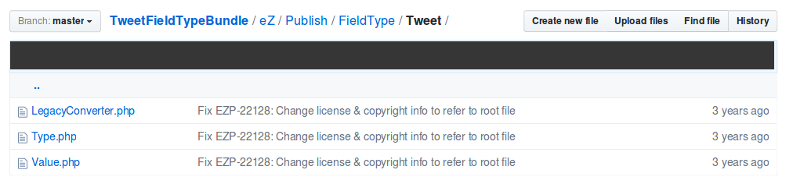

# Structure the bundle

At this point, you have a basic application-specific Symfony 2 bundle. Let’s start by creating the structure for your Field Type.

To make it easier to move around the code, you will to some extent mimic the structure that is used in the kernel of eZ Platform. Native Field Types are located inside `ezpublish-kernel` (in `vendor/ezsystems`), in the `eZ/Publish/Core/FieldType` folder.
Each Field Type has its own subfolder: `TextLine`, `Email`, `Url`, etc.

Clone this GitHub repository to follow this tutorial, it will be useful: (https://github.com/ezsystems/TweetFieldTypeBundle).

You will use a structure quite close to this:

From the tutorial git repository, list the contents of the `eZ/Publish/FieldType` folder:

     eZ
     └── Publish
        └── FieldType
            └── Tweet
                ├── Type.php
                └── Value.php

A Field Type requires two base classes: `Type` and `Value`.

### The Type class

The Type contains the logic of the Field Type: validating data, transforming from various formats, describing the validators, etc.
A Type class must implement `eZ\Publish\SPI\FieldType\FieldType`. It may also extend the `eZ\Publish\Core\FieldType\FieldType` abstract class.

### The Value class

The Value is used to represent an instance of our type within a Content item. Each Field will present its data using an instance of the Type’s Value class.
A value class must implement the `eZ\Publish\SPI\FieldType\Value` interface. It may also extend the `eZ\Publish\Core\FieldType\Value` abstract class.

------------------------------------------------------------------------

⬅ Previous: [Create the bundle](create_the_bundle.md)

Next: [Implement the Tweet\\Value class](implement_the_tweet_value_class.md) ➡
